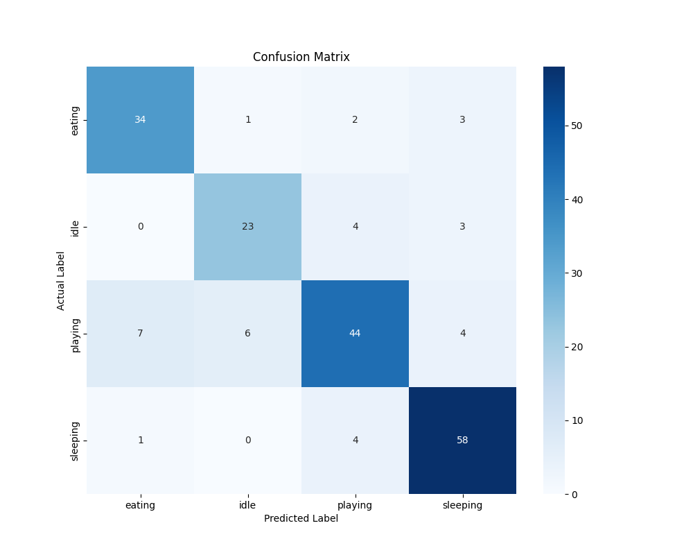

# Smart Cat Monitor

This project was developed to use computer vision to monitor cats in real time. In addition to just monitoring them, it is able to classify cat behaviors. It boasts a built out pipeline for data collection, model training, evaluation, and live deployment.

# Features
- **Real-Time Cat Detection:** Utilized YOLOv8n to detect cats from a given video stream.
- **Activity Classification:** Using a finely tuned MobileNetV3 model to classify a cat's activity to one of four categories: eating, sleeping, playing, or idle.
- **Flexible Modes:**
    - **Live Classification Mode:** Runs the detector and classifier in real time to detect cats on the feed, and classify them to one of the activities.
    - **Data Labeling Mode:** Runs a global hot key system and the detector to allow you to easily and quickly capture and label new entries into the dataset. The hot keys work even when the detector window is not in focus making it easier to label.
- **Complete Pipeline**
    - **`train.py`:** A thorough script to train the MobileNet model for activity classification using transfer learning and a two phase fine tuning approach.
    - **`evaluate.py`:** Generates a confusion matrix to gain insight into where the model is succeeding, and failing. This helps to analyze performance, and aid in identifying areas needing improvement.
    - **`review.py`:** An interactive tool to quickly and efficiently clean up datasets. This helped in reducing ambiguity and increasing model accuracy.

## Technology Stack

- **Programming Language:** Python
- **Computer Vision:** OpenCV
- **Deep Learning Framework:** PyTorch
- **Object Detection Model:** YOLOv8n
- **Classification Model:** MobileNetV3
- **Utilities:** 'pynput' for global keyboard listening, 'scikit-learn' for evaluation metrics, 'seaborn' and 'matplotlib' for matrix plotting.

## Setup and Installation

1. **Clone the repo:**
    ```git clone https://github.com/tylerlv3/catMonitor```

2. **Create Virtual Env (Optional):**
    ```python3 -m venv venv```
    ```source venv/bin/activate```

3. **Install Requirements:**
    ```pip install -r requirements.txt```

4. **Download YOLO weights:**
    The `detector.py` script will attempt to download the YOLOv8n weights upon first run.

## Usage

The project has several scripts that do different tasks to complete the ML creation process.

### 1. Data Collection (`review.py` and `main.py`)

First, you must collect some high quality data for the respective categories.

-   **To manually label images from a livestream or screen stream:**
    1. In `main.py`, set `MANUAL_CLASSIFICATION = True`.
    2. Run `main.py`, ```python main.py```
    3. a window will appear with the feed in it whether a camera or your screen. It is now listening for global key presses.
    4. pressing the keys (denoted in the top left of the feed screen): `e`: eating, `s`: sleeping, `p`: playing, `i`: idle. Pressing any of these will save the last detection and label it with the key pressed.
    5. press `q`: exit when done labeling.

-   **To review and clean your new dataset:**
    1. run `review.py`, ```python review.py```.
    2. A window will open displaying the first image contained in the first directory of the dataset. You will then be taken through all images sequentially in both `dataset/train` and `dataset/val`. On each image you have a choice of keys to press: `k` will keep the image, `d` will delete the image. Once all images are decided on, the window will close.

### 2. Model Training (`train.py`)

Once you have acquired some good data, you can move onto training the model.

-   Run the training script:
    ```python train.py```
-   This will use the images in the `dataset/` directory to fine tune the model and save the best performing epoch as `cat_classifier.pth`.

### 3. Model Evaluation (`evaluate.py`)

This will analyze the performance of the newly trained model.

-   Run the evaluation script:
    ```python evaluate.py```
-   This will generate a png of a `confusion_matrix.png' and print a detailed classification report to console.

Here is an example of a generated confusion matrix:



### 4. Live Classification (`main.py')

Use the newly trained model to classify cat behavior in real time!

1. In `main.py`, set `MANUAL_CLASSIFICATION = False`.
2. Run the script `main.py`, ```python main.py```
3. The application will open in a window similar to the manual classification one, but instead it will now draw bounding boxes around detected cats in real-time with a label of the predicted activity.
4. Press `q` to quit.

## License

This project is licensed under the MIT License - see the [LICENSE](LICENSE) file for details.


